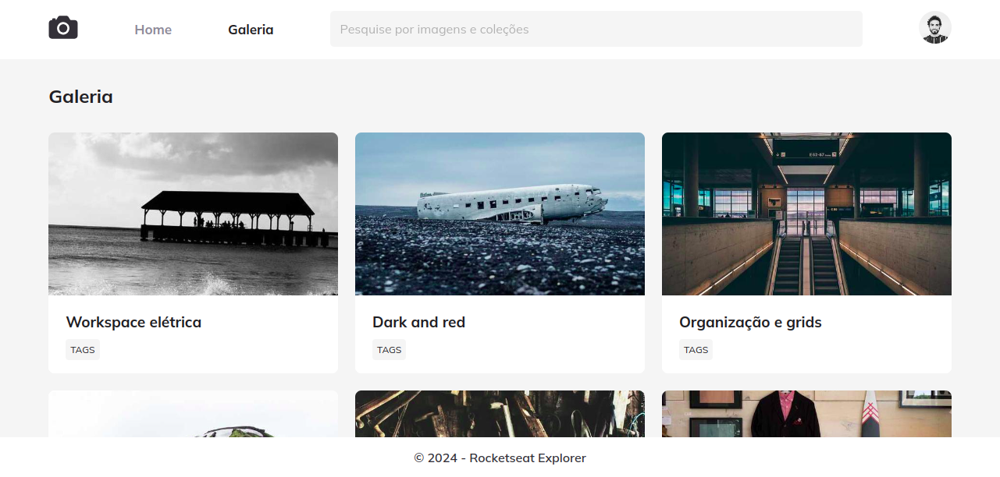

# Fotoblog
Este projeto apresenta um <b>layout moderno e elegante</b> para uma galeria de fotos, projetado para destacar suas imagens de maneira visualmente atraente. Com um <b>design totalmente responsivo</b>, a galeria se adapta perfeitamente a qualquer dispositivo, proporcionando uma experiência incrível, seja em desktops, tablets ou smartphones. Explore a beleza da simplicidade com este layout inovador!

## 💻 Layout


## 🔧 Linguagens
 - HTML
 - CSS

## 🤖 Clonar repositório

1. Clone o repositório:
```bash
  git clone https://github.com/CaioAlves10/explorer-stage-03-fotoblog.git
```

2. Entre no diretório:
```bash
  cd explorer-stage-03-fotoblog
```

<br />

---

<br />

<p align="center">
  Feito com 💙 por Caio Carvalho
</p>